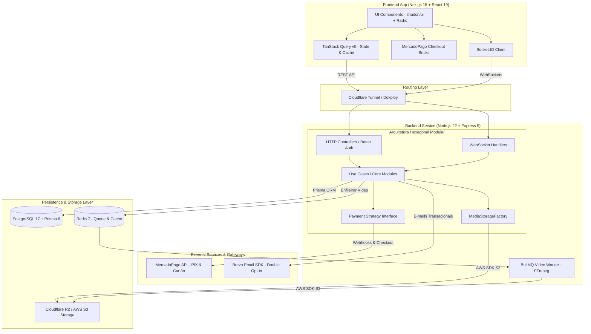

# 💅 Elegance Beauty — Plataforma Unificada de Beleza, E-Commerce & Educação

> **📌 Showcase / Case Study Técnico (White-Label SaaS)**  
> Este repositório é uma demonstração de arquitetura e estudo de caso do **Elegance Beauty**, um ecossistema completo para o mercado de beleza e estética que integra agendamento de serviços em tempo real, e-commerce de produtos físicos e uma plataforma de cursos online. Este documento detalha a arquitetura de software, padrões de projeto e decisões de engenharia adotados no sistema.

---

<p align="center">
  
  
  
  
  
  
  
  
</p>

---

## 🎯 Sobre o Projeto & Impacto de Negócio

O **Elegance Beauty** foi projetado para unificar a jornada completa do cliente no mercado da beleza em uma única plataforma web de alta performance:

### 💡 Três Pilares Integrados:
* **📅 Agendamento de Serviços:** Gestão dinâmica de horários, regras de disponibilidade por profissional, cancelamentos e notificações transacionais em tempo real via WebSockets.
* **🛍️ E-Commerce com Checkout:** Catálogo de produtos físicos com gestão de estoque, variações (tamanho/cor), cálculo de frete e múltiplos endereços de entrega.
* **🎓 Educação & Cursos Online:** Plataforma EAD com distribuição de videoaulas, controle de progresso por módulo, matrículas e liberação de acessos após confirmação de pagamento.

---

## 📸 Demonstração Visual (UI / UX)

| Agendamento & Calendário Profissional | Loja Virtual & Checkout | Plataforma de Cursos |
| :---: | :---: | :---: |
|  |  |  |

---

## 🏗️ Arquitetura de Software & Diagrama do Sistema

O backend foi construído sob os princípios da **Arquitetura Hexagonal Modular (Ports & Adapters)** e **SOLID**, permitindo desacoplamento total das regras de negócio em relação aos gateways de pagamento (MercadoPago) e provedores de storage de mídia (Local / Cloudflare R2 / AWS S3).


## 🛠️ Tech Stack Completa

### Frontend Ecosystem
- **Core:** Next.js 15.4 (App Router), React 19.1, TypeScript 5.8
- **Styling & UI:** Tailwind CSS v4, shadcn/ui, Radix UI
- **State Management & Fetching:** TanStack Query v5 (React Query)
- **Forms & Validation:** React Hook Form v7, Zod v4
- **Auth & Session:** Better Auth 1.4 (Google OAuth 2.0 + E-mail/Senha)
- **Payments UI:** MercadoPago Checkout Bricks (`@mercadopago/sdk-react`)
- **Calendar & Charts:** `react-big-calendar`, `recharts`
- **Testing:** Vitest

### Backend & Infrastructure
- **Runtime & Framework:** Node.js 22+, Express 5.1 (Arquitetura Hexagonal Modular)
- **Database & ORM:** PostgreSQL 17, Prisma ORM 6.17
- **Authentication & RBAC:** Better Auth 1.4 (Sessões seguras, Roles: ADMIN, CLIENT, Professional Flags)
- **Background Jobs & Queues:** BullMQ v6 + Redis 7 (processamento assíncrono de vídeo)
- **Payments Engine:** MercadoPago SDK Node (`@mercadopago/sdk-node`) via Strategy Pattern
- **Transactional Email:** Brevo SDK v5 (`@getbrevo/brevo`) com templates HTML e Double Opt-in
- **Cloud Storage:** MediaStorageFactory (Suporte agnóstico para Local, Cloudflare R2 e AWS S3)
- **Containerization & Deployment:** Docker Compose, Cloudflare Tunnel (Dokploy)
- **Testing:** Vitest, Supertest, `fast-check` (Property-Based Testing)

---

## ⚡ Destaques da Engenharia & Decisões Técnicas

1. **Pipeline de Processamento Assíncrono de Vídeo (BullMQ + Redis + FFmpeg)**  
   Uploads de vídeo para cursos e produtos respondem imediatamente (`HTTP 201 Processing`). O arquivo RAW é enfileirado no Redis via BullMQ e processado por workers usando FFmpeg (CRF 26/28 H.264), emitindo notificações via Socket.IO ao término.

2. **Padrão Strategy para Gateways de Pagamento**  
   A camada de pagamentos foi construída sob uma interface agnóstica (`PaymentProviderStrategy`). A implementação atual integra o MercadoPago (PIX, Cartão e Webhooks), permitindo a adição de novos provedores (Stripe, Pagar.me) sem alterar as regras de negócio de pedidos.

3. **MediaStorageFactory (Arquitetura Agnóstica de Storage)**  
   Implementação do padrão Factory para gerenciamento de arquivos. Em ambiente de desenvolvimento, opera com storage em disco local; em produção, comuta transparentemente para Cloudflare R2 ou AWS S3 via API S3 com custo zero de *egress fees*.

4. **Testes de Integração e Property-Based Testing**  
   Suíte de testes de integração rodando em container isolado de banco de dados (`postgres_test`) combinada com testes baseados em propriedades usando `fast-check` para validação matemática e lógica de invariantes de domínio.

---

## 📂 Estrutura Modular do Projeto

```text
elegance-beauty/
├── app/
│   ├── backend/                        # API Node.js + Express 5 (Hexagonal Modular)
│   │   ├── src/
│   │   │   ├── app/
│   │   │   │   ├── modules/            # Módulos de Negócio Isolados
│   │   │   │   │   ├── analytics/      # Métricas e relatórios financeiros
│   │   │   │   │   ├── ecommerce/      # Produtos, estoque e variações
│   │   │   │   │   ├── education/      # Cursos, módulos e progresso EAD
│   │   │   │   │   ├── orders/         # Pedidos (E-commerce + Cursos)
│   │   │   │   │   ├── payments/       # Gateway de Pagamento (Strategy Pattern)
│   │   │   │   │   └── scheduling/     # Agendamentos e disponibilidade
│   │   │   ├── infrastructure/
│   │   │   │   ├── external-services/  # MediaStorageFactory, VideoProcessingWorker
│   │   │   │   ├── http/               # Controllers, Middlewares, Routes
│   │   │   │   └── database/           # Cliente Prisma & Migrações
│   │   └── prisma/                     # Schemas PostgreSQL
│   ├── frontend/                       # Next.js 15 App Router + React 19
│   │   └── src/
│   │       ├── app/
│   │       │   ├── (auth)/             # Login, Registro, OAuth
│   │       │   ├── (dashboard)/        # Painel Administrativo & Profissional
│   │       │   └── (public)/           # Agendamento, Loja, Cursos & Checkout
│   │       ├── _components/            # Componentes UI (shadcn/ui)
│   │       └── _contexts/              # Carrinho e Estado Global
│   └── docker-compose.yml              # PostgreSQL (Dev/Test) + Redis 7
```
## 🧪 Suíte de Testes

O projeto conta com testes unitários e de integração focados na camada de domínio e casos de uso:

```bash
# Execução dos testes via Vitest
pnpm vitest run --reporter=verbose "feed"
pnpm vitest run --reporter=verbose "message"
pnpm vitest run --reporter=verbose "group"
```
## 👨‍💻 Autor & Engenharia de Software

**Enderson Millan** — *Software Engineer / Full Stack Developer*

- 🌐 **Website / Portfólio:** [endersonmillan.com](https://www.endersonmillan.com/)
- 💼 **LinkedIn:** [linkedin.com/in/enderson-millan](https://www.linkedin.com/in/enderson-millan)
- ✉️ **E-mail:** [millanendersondev@gmail.com](mailto:millanendersondev@gmail.com)
- 📺 **YouTube:** [@millanendersondev](https://www.youtube.com/@millanendersondev)
